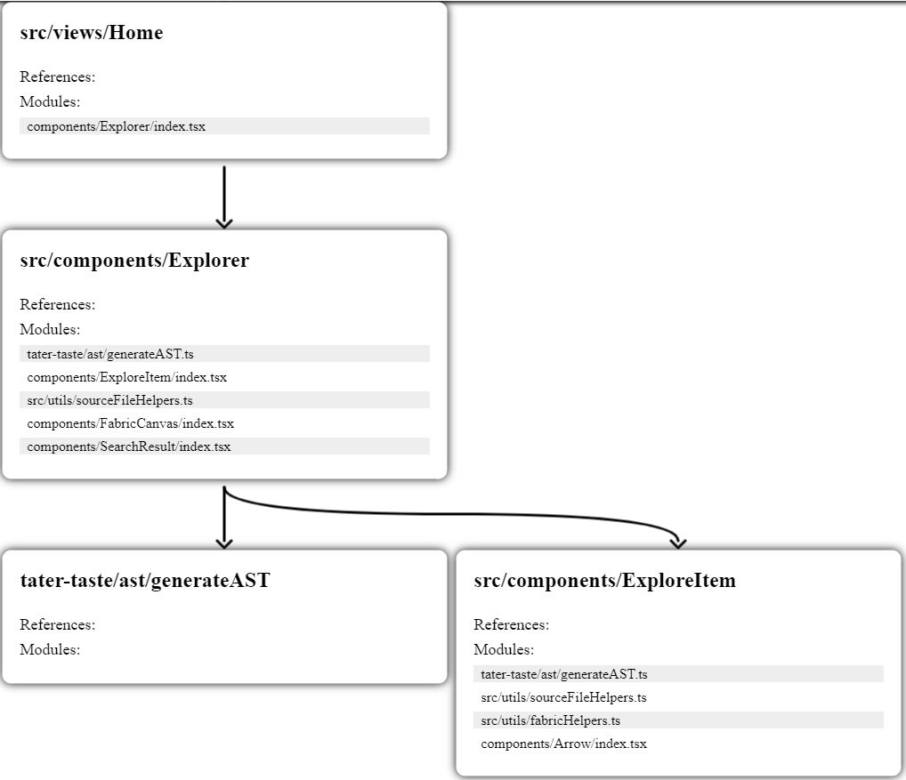

# tater-taste
Tater - TypeScript Abstract Syntax Tree Explorer

Explore your codebase visually, and follow code paths more easily. Don't get lost (hopefully).

## Get Started

Analyze your code base using `npx tater-taste@latest`

This will host a website locally at localhost:4444 where you can browse your codebase.

### Options
Specify the entry file if it is not in the current working directory and named index.ts by passing the path as an argument.

For Example:

`npx tater-taste@latest client/src/App`

## Contributing

Start a local server using `yarn start`

To work on changes to the frontend, run `yarn watch` concurrently.

To publish changes, make sure to compile the code using `yarn build` first.
